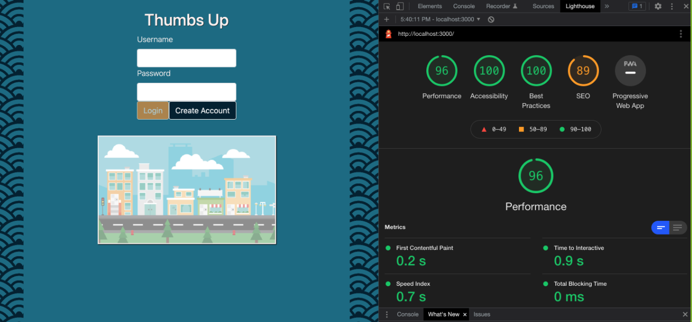

# Overview
Thumbs Up is a fullstack web application for connecting riders with drivers in their area. Drivers are able to plan trips and approve or decline requests from riders to join. Riders are able to search for nearby trips and request a seat.
The goal of Thumbs Up is to provide rides to those without access and reduce fuel costs, carbon emissions, and traffic through carpooling.

---

## Usage
This application has been deployed on heroku: https://thumbsup-sterling.herokuapp.com/

- **Sample Driver:**
    - Username: MrFripple
    - Password: 123
-  **Sample Rider:**
    - Username: FryGuy
    - Password: 456

### Sign-in as Driver, add new trip

### Sign-in as Rider, search for new trip

### As driver, approve ride request and send message

### As rider, view completed trips and rate driver

---

## Performance

## Authors

  - **Neil Mosser** - *Created Routing using React Router, and fleshed out the rider portal and linked pages.  Created server calls for rider* -
    [NeilMosser](https://github.com/NeilMosser)

  - **Sterling Mueller** - *Provided styling, including the login page animation, and wroked on rider pages* -
    [sterlingmuller](https://github.com/sterlingmuller)

  - **Matt Dziedzic** - *Created the chat component and its integrations* -
    [MrFripple](https://github.com/MrFripple)
    
  - **Ezra Pullido** - *Created maps, directions, and routing* -
    [ezra=pullido](https://github.com/ezra-pullido)

  - **Mitchell Gardner** - *Created dummy data, created driver portal and hamburger menu* -
    [Mitch311G](https://github.com/Mitch311G)

  - **Prith Jaganathan** - *Created the chat component and its integrations* -
    [prith98](https://github.com/prith98)

## Acknowledgments
  - Hack Reactor
  - DEN16
